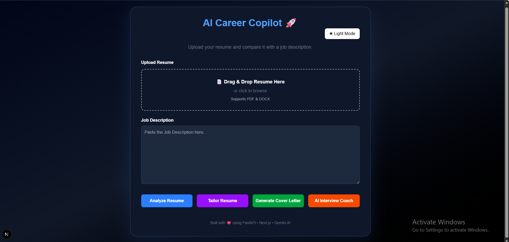
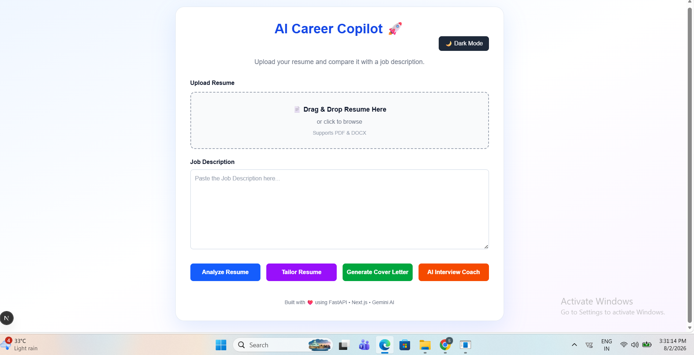
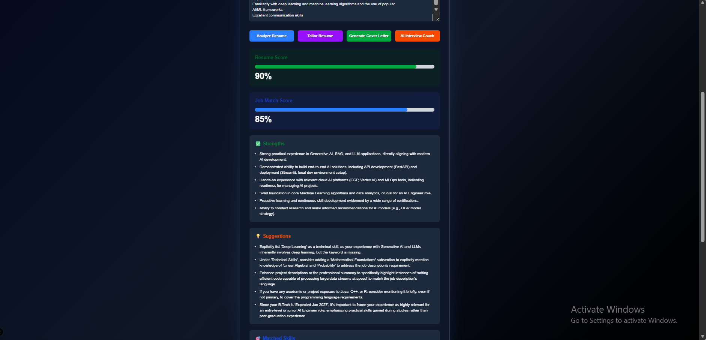
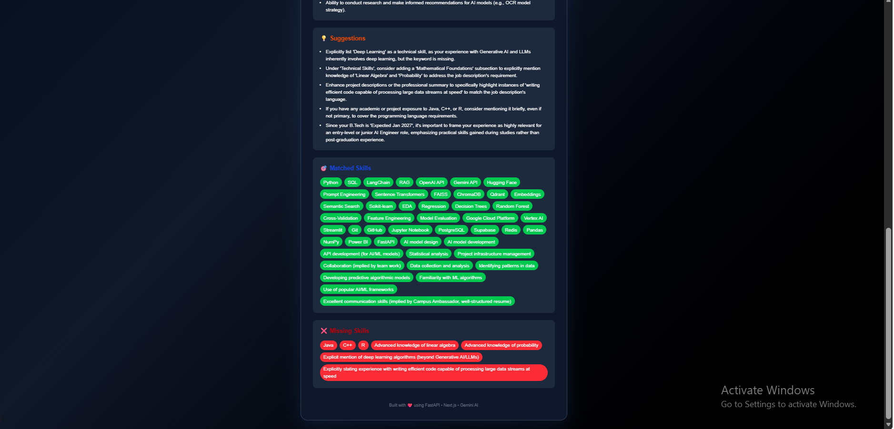
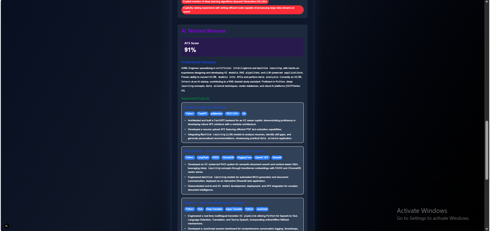
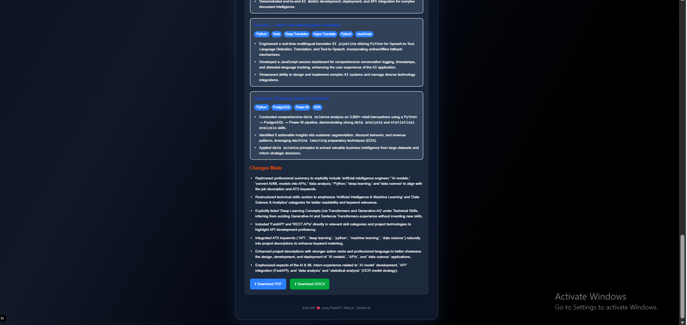
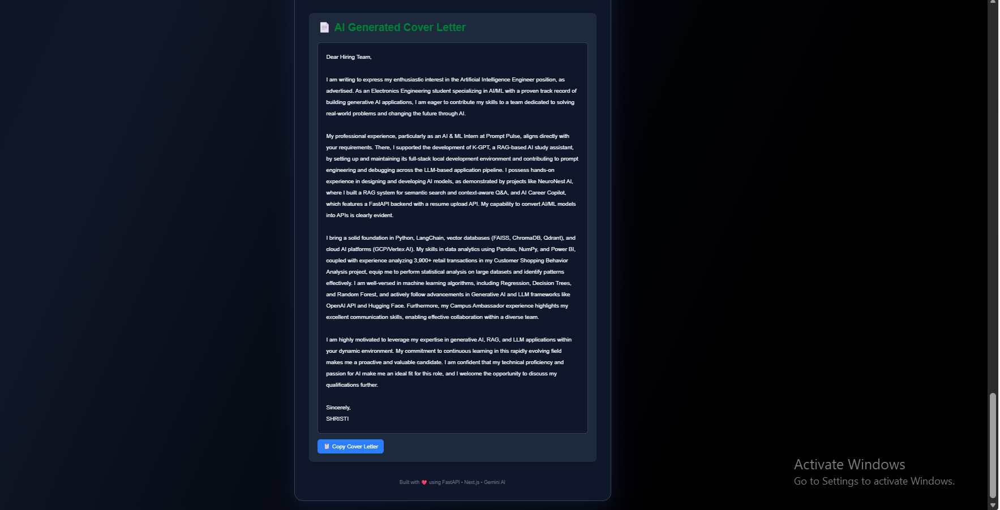
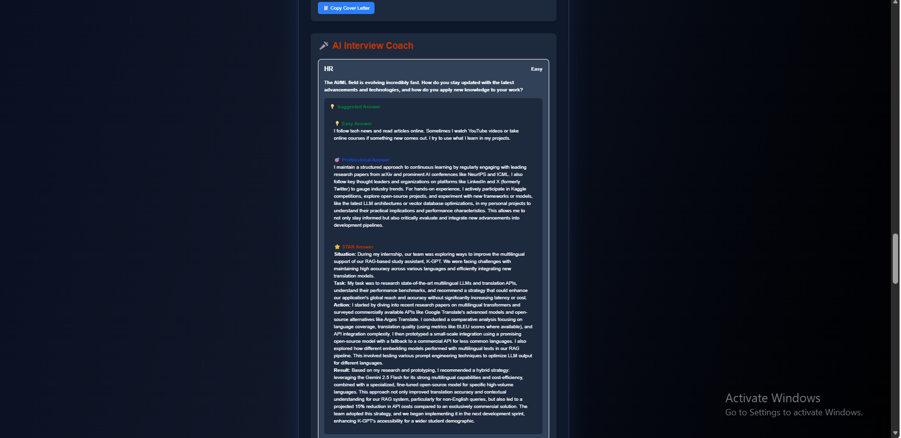

# 🚀 AI Career Copilot
### AI-powered Resume Analyzer • Resume Tailoring • Cover Letter Generator • Interview Coach


An AI-powered career assistant that analyzes resumes, optimizes them for ATS, tailors them to specific job descriptions, generates professional cover letters, and prepares users for interviews using Google Gemini AI with an intelligent Ollama fallback.

## 🌐 Live Demo

 https://ai-career-copilot-black.vercel.app

---

## ✨ Features

### 📄 Resume Analysis
- ATS Resume Score
- Job Match Score
- Resume Strengths
- Improvement Suggestions
- Matched Skills
- Missing Skills

---

### 🎯 AI Resume Tailoring
- ATS-Optimized Professional Summary
- Tailored Project Descriptions
- Resume Improvements
- Download Tailored Resume (PDF & DOCX)

---

### 💌 Cover Letter Generator
- AI-generated personalized cover letters
- Copy with one click
- Download as PDF

---

### 🎤 AI Interview Coach
Generates interview questions with:

- Easy Answer
- Professional Answer
- STAR Answer

for:
- HR Interviews
- Technical Interviews
- Behavioral Interviews

---

## 🛠 Tech Stack

### Frontend
- Next.js
- React
- TypeScript
- Tailwind CSS
- React Markdown

### Backend
- FastAPI
- Python
- Pydantic
- PDF Parsing
- DOCX Parsing

### AI
- Google Gemini 2.5 Flash
- Ollama (Qwen2.5 7B Fallback)
- Automatic fallback to Ollama whenever Gemini quota is exhausted.

---

## 📂 Project Structure

```text
AI-Career-Copilot/

├── backend/
├── frontend/
├── screenshots/
├── README.md
├── LICENSE
└── .gitignore

```

---

## ⚙ Installation

### Clone Repository

```bash
git clone https://github.com/shristi102005-spec/AI-Career-Copilot.git

cd AI-Career-Copilot
```

### Backend

```bash
cd backend

python -m venv venv

venv\Scripts\activate

pip install -r requirements.txt

uvicorn app.main:app --reload
```

### Frontend

```bash
cd frontend

npm install

npm run dev
```

---

## 🔑 Environment Variables

Backend `.env`

```env
GEMINI_API_KEY=YOUR_API_KEY
```

---

## 📸 Screenshots

### 🌙 Landing Page (Dark)



---

### ☀ Landing Page (Light)



---

### 📊 Resume Analysis





---

### 🤖 Tailored Resume





---

### 💌 Cover Letter



---

### 🎤 Interview Coach




---

## Skills Demonstrated

✔ FastAPI
✔ Next.js
✔ React
✔ TypeScript
✔ TailwindCSS
✔ REST APIs
✔ Gemini API
✔ Ollama
✔ Prompt Engineering
✔ ATS Resume Analysis
✔ Markdown Rendering
✔ PDF Generation
✔ AI Interview Preparation

---

## 🚀 Future Improvements

- Multi-language Resume Support
- Authentication
- Resume Templates
- AI Mock Interview Voice Mode
- Resume Version History
- Job Recommendation Engine
- LinkedIn Optimization

---

## 👩‍💻 Author 

**Shristi**

B.Tech Electronics Engineering (AI & ML)

Passionate about AI, Machine Learning, and Full Stack AI Applications.

Built with ❤️ using FastAPI, Next.js and Google Gemini.

LinkedIn: https://www.linkedin.com/in/shristi-483363295/

GitHub: https://github.com/shristi102005-spec

---

## ⭐ If you like this project

If you found this project useful, consider giving it a ⭐ on GitHub!